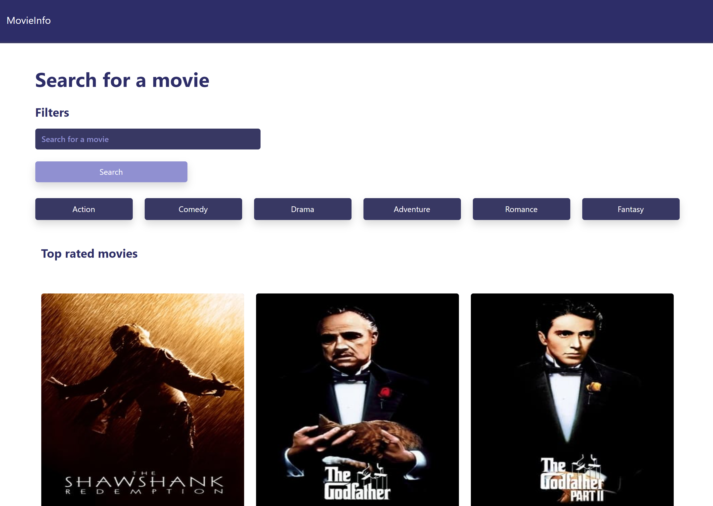
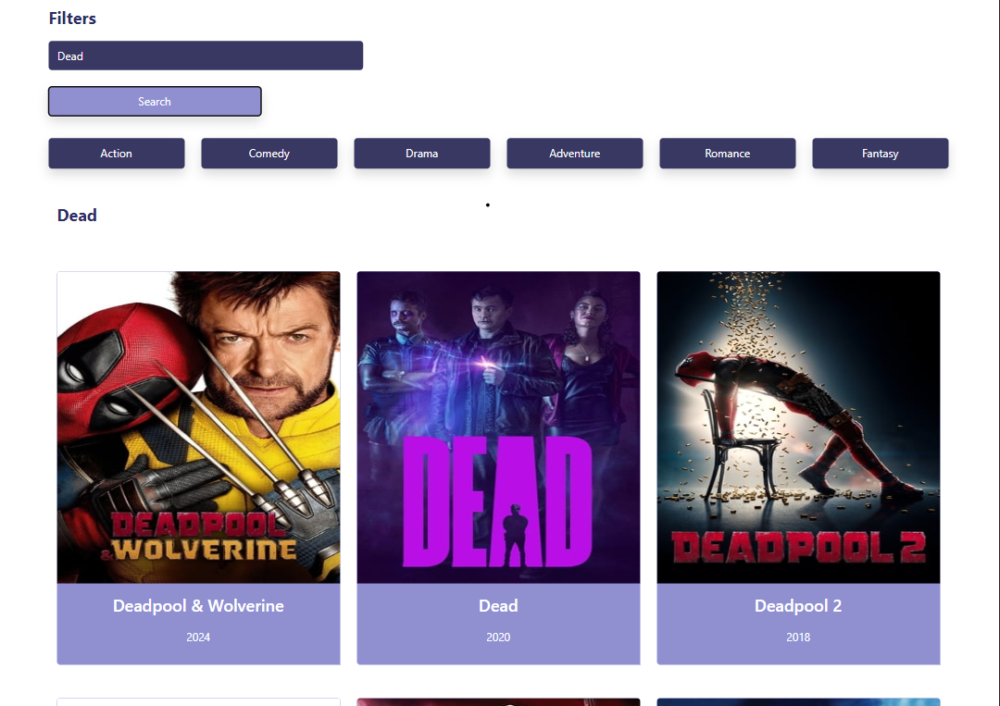
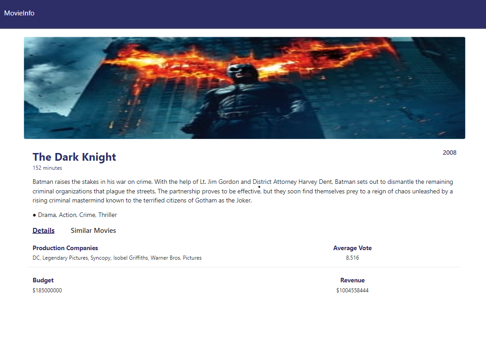
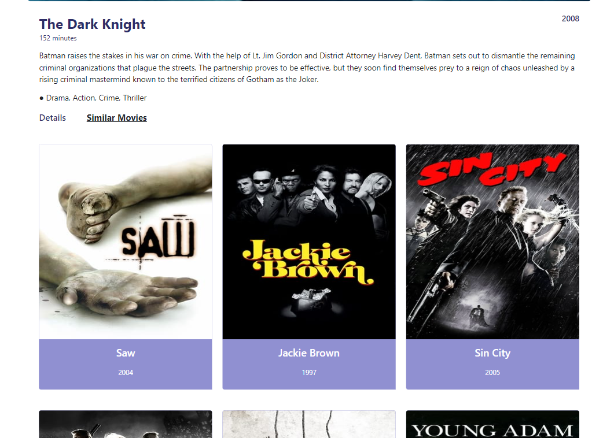

# Movie Finder

Movie Finder is a React-based web application that allows users to search for movies, view top-rated movies, and see detailed information about specific films. The application uses [The Movie Database (TMDB) API](https://www.themoviedb.org/documentation/api) to retrieve data in real time.

## Features

- **Search Movies**: Users can search for any movie by title.
- **Top-Rated Movies**: Display a list of top-rated movies.
- **Movie Details**: View detailed information about a movie, including the poster, release date, overview, and genres.
- **Responsive Design**: Fully responsive UI built with Bootstrap.

## Screenshots

### Home Page

### Movie Search

### Movie Details

### Similar Movies

